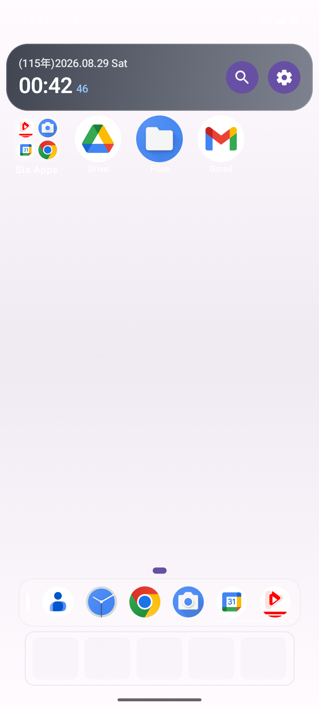
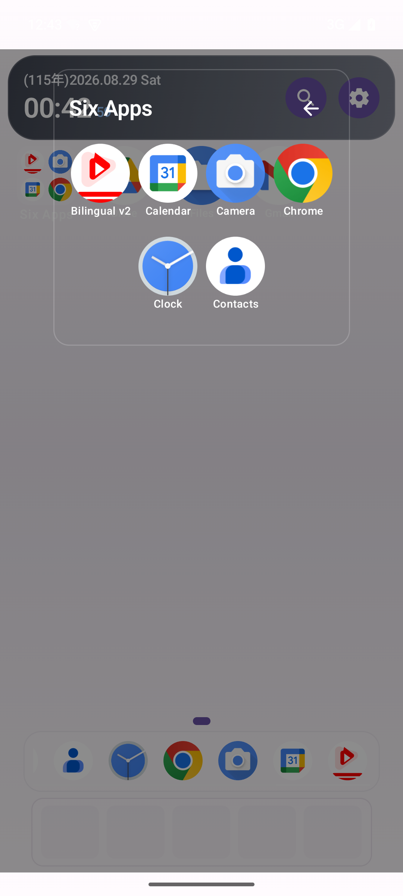

# Launcher Layout Studio

Android launcher plus a dependency-free browser editor for designing, exporting, and applying launcher layouts.

The Android app exports the installed app catalog, while the local desktop editor arranges pages, folders, dock items, widgets, and shortcuts into a portable JSON layout.

  
  

> The screenshots above use emulator/test data only. They do not contain a personal device backup.

## Features

- Kotlin and Jetpack Compose Android launcher
- Request and operate as the Android HOME app
- Export installed launchable apps as JSON
- Import and export launcher layouts
- Multiple pages, dock, folders, widgets, shortcuts, and recent apps
- Drag, resize, move, and remove home-screen items
- Accept Android pinned shortcuts such as Chrome “Add to Home screen”
- Dependency-free HTML/CSS/JavaScript desktop layout editor
- Read-only, signature-protected bridge between test variants

## Architecture

~~~text
Android launcher
  ├─ discovers launchable activities and widget providers
  ├─ stores layout in app-private storage
  ├─ exports apps.json / launcher-backup.json
  └─ renders pages, dock, folders, widgets, and shortcuts

Desktop editor
  ├─ opens apps.json and launcher-backup.json locally
  ├─ edits grid positions, pages, folders, and dock
  └─ downloads a new launcher-backup.json
~~~

The editor does not require a server, package manager, or build step.

## Quick start

### Android app

1. Open the android/ directory in Android Studio.
2. Let Gradle sync.
3. Install the app on an emulator or test device.
4. Choose **Make Default Home**.
5. Use **Export Apps** to save apps.json.

Command-line debug build:

~~~powershell
cd android
.\gradlew.bat assembleStandardDebug
~~~

### Desktop editor

1. Open editor/index.html in a browser.
2. Load the exported apps.json.
3. Arrange apps, folders, pages, and dock items.
4. Export launcher-backup.json.
5. Import the layout from the Android app.

## Data format

The exported files may contain:

- app labels, package names, and activity names
- dock and page placement
- folder membership
- recent-app references
- widget provider identifiers
- shortcut intent URIs
- an app-private wallpaper path

Treat real exports as personal device data. Do not commit them, attach them to issues, or use them as public examples.

The README screenshots and public examples should use emulator-only data.

## Privacy and security

- The Android manifest does not request Internet access.
- Android system backup is disabled because launcher layouts and app catalogs can reveal device usage.
- The desktop editor runs locally and uses system fonts; it does not load remote scripts or fonts.
- The cross-variant layout provider requires a signature-level permission and validates the caller package.
- Imported layout files should come from a trusted source because layouts can contain shortcut intent data.
- work/, outputs/, device backups, UI dumps, local SDK paths, truststores, APKs, and real-device screenshots are intentionally excluded from Git.

## Project layout

~~~text
android/          Kotlin + Compose launcher
editor/           Local browser layout editor
design/           Source design assets
docs/images/      Public-safe emulator screenshots
~~~

## Limitations

- Does not import OEM launcher databases
- Does not require or provide root integrations
- App icons are resolved on the Android device rather than embedded in desktop exports
- Launcher and widget behavior can vary by Android vendor

## License

No open-source license has been selected yet. Add a license before accepting external reuse or contributions.
